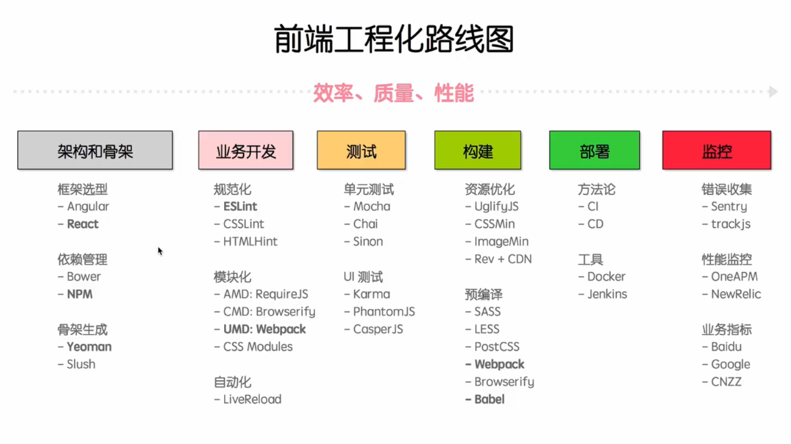

# 前端工程化 


#  npm
```bash
    1. 通过cnpm使用
    npm install - g cnpm--registry = https://registry.npm.taobao.org

    2. 常用框架指令
    npm install  //根据当前目录下package.json下载相关依赖
    npm run start/build //运行 package.json script 
```
```json
// package.json 
{
  "name": "frame-v2.0.0",
  "version": "2.0.0",
  "description": "前端框架", 
  "scripts": {
    "dev": "cross-env NODE_ENV=development webpack-dev-server --mode development ",
    "build": "cross-env NODE_ENV=production webpack --mode production"
  },
  "author": "ywkang",
  "license": "ISC",
  "devDependencies": {//调试依赖
    "babel-core": "^6.26.3",
    "babel-helper-vue-jsx-merge-props": "^2.0.3",
    "babel-loader": "^7.1.4",
    "babel-plugin-component": "^1.1.1",
    "babel-plugin-syntax-jsx": "^6.18.0",
    "babel-plugin-transform-runtime": "^6.23.0",
    "babel-plugin-transform-vue-jsx": "^3.7.0",
    "babel-polyfill": "^6.26.0",
    "babel-preset-env": "^1.7.0",
    "babel-preset-es2015": "^6.24.1",
    "babel-preset-stage-2": "^6.24.1",
    "clean-webpack-plugin": "^0.1.19",
    "cross-env": "^5.2.0",
    "css-loader": "^0.28.11",
    "file-loader": "^1.1.11",
    "friendly-errors-webpack-plugin": "^1.7.0",
    "html-webpack-plugin": "^3.2.0",
    "less": "^3.0.4",
    "less-loader": "^4.1.0",
    "mini-css-extract-plugin": "^0.4.1",
    "optimize-css-assets-webpack-plugin": "^4.0.3",
    "progress-bar-webpack-plugin": "^1.11.0",
    "purify-css": "^1.2.5",
    "purifycss-webpack": "^0.7.0",
    "style-loader": "^0.21.0",
    "url-loader": "^1.0.1",
    "vue-loader": "^15.2.4",
    "vue-template-compiler": "^2.5.16",
    "webpack": "^4.14.0",
    "webpack-cli": "^3.0.8",
    "webpack-dev-server": "^3.1.4",
    "webpack-manifest-plugin": "^2.0.3",
    "webpack-merge": "^4.1.3"
  },
  "dependencies": {//生产依赖
    "axios": "^0.18.0",
    "echarts": "^4.1.0",
    "element-ui": "^2.4.2",
    "jquery": "^3.3.1",
    "md5": "^2.2.1",
    "qs": "^6.5.2",
    "vue": "^2.5.16",
    "vue-router": "^3.0.1",
    "vuex": "^3.0.1"
  }
}
```
# webpack4 构架工具
1. 性能 代码分割，公共代码提取，提取有效代码,缓存持久化
2. 效率 自动化编译刷新（liveReload），代码有效性检验，自动化测试（karma），css预编译，js/css编译压缩提取（babel）（E6+）
3. 质量 cssint eslint htmlint 代码规范性，有效性，单元测试、ui测试
4. 安全

//base
```js
const path = require('path');
const webpack = require('webpack');
const {VueLoaderPlugin} = require('vue-loader');
const HtmlWebpackPlugin = require('html-webpack-plugin');
const ManifestPlugin = require('webpack-manifest-plugin');
const MiniCssExtractPlugin = require("mini-css-extract-plugin");
const ProgressBarPlugin = require('progress-bar-webpack-plugin');
const devMode = process.env.NODE_ENV !== 'production';

module.exports = {
    entry: {//垫片，入口，引入
        'main': ['babel-polyfill', './scripts/main.js', './scripts/polyfill.js'],
        'jquery': ['jquery'],
        'echarts': ['echarts']
    },
    context: path.join(process.cwd(), 'app'),
    resolve: {//优先匹配后缀
        extensions: ['.vue', '.js', '.css', '.less']
    },
    module: {
        rules: [{
            test: /\.vue$/,
            loader: 'vue-loader'
        }, {
            test: /\.js$/,
            loader: 'babel-loader',
            exclude: file => (
                /node_modules/.test(file) &&
                !/\.vue\.js/.test(file)
            )
        }, {
            test: /\.css$/,
            use: [{
                    loader: MiniCssExtractPlugin.loader
                },
                "css-loader"
            ]
        }, {
            test: /\.less$/,
            use: [
                devMode ? 'vue-style-loader' : MiniCssExtractPlugin.loader,
                "css-loader",
                "less-loader"
            ]
        }, {
            test: /\.(png|jpe?g|gif|svg|woff|woff2|ttf|eot|ico|swf)$/,
            use: [{
                loader: 'url-loader',
                options: {
                    limit: 1000,
                    name: './images/[name].[ext]'
                }
            }]
        }]
    },
    optimization: {//公共提取，代码分割提取
        runtimeChunk: {
            name: "manifest",
        },
        splitChunks: {
            cacheGroups: {
                echarts: {
                    test: 'echarts',
                    name: 'echarts',
                    chunks: 'initial'
                },
                jquery: {
                    test: 'jquery',
                    name: 'jquery',
                    chunks: 'initial'
                },
            }
        }
    },
    plugins: [
        new VueLoaderPlugin(),
        new webpack.DefinePlugin({
            NODE_ENV: JSON.stringify(process.env.NODE_ENV)
        }),
        new MiniCssExtractPlugin({
            filename: devMode ? '[name].css' : '[name].[contenthash:8].css'
        }),
        new webpack.ProvidePlugin({
            $: 'jquery',
            jQuery: 'jquery',
            'window.jQuery': 'jquery' 
        }),
        new HtmlWebpackPlugin({
            template: 'index.html',
            favicon: './favicon.ico',
            inject: true,
            minify: {
                removeComments: true,
                collapseWhitespace: true,
                removeAttributeQuotes: true
            },
            chunksSortMode: 'dependency'
        }),
        new ManifestPlugin(),
        new webpack.HashedModuleIdsPlugin(),
        new ProgressBarPlugin()
    ]
};
```
//dev
```js
const webpack = require('webpack');
const webpackCommon = require('./webpack.common');
const webpackMerge = require('webpack-merge');
const FriendlyErrorsWebpackPlugin = require('friendly-errors-webpack-plugin');
const port = 8081;
module.exports = webpackMerge(webpackCommon, {
    devtool: 'source-map',
    devServer: {
        hot: true, //热加载  
        historyApiFallback: true,
        host: 'localhost',
        compress: false, // 服务器返回浏览器的时候是否启动gzip压缩 
        inline: true, // 文件改变自动刷新页面
        progress: false, // 显示编译进度 
        port: port, // 服务器端口 
        stats: 'minimal',
        quiet: true,
        noInfo: true,
        clientLogLevel: 'none',
        overlay: {
            errors: true
        },
        proxy: [ 
            {
                context: ['/'],
                target: 'http://10.48.186.11:8999',
                changeOrigin: true,
                secure: false
            }
        ]
    },
    watchOptions: {
        ignored: /node_modules/, //忽略不用监听变更的目录
        aggregateTimeout: 300, //防止重复保存频繁重新编译,500毫米内重复保存不打包
        poll: 1000 //每秒询问的文件变更的次数 
    },
    plugins: [
        new webpack.HotModuleReplacementPlugin(), //HMR
        new webpack.NamedModulesPlugin(), // HMR
        new FriendlyErrorsWebpackPlugin({
            compilationSuccessInfo: {
                messages: [`You application is running here http://localhost:${port}`], 
                clearConsole: true
            }
        })
    ]
});
```

# Webapck启动执行顺序

```bash
npm run start -->webpackconfog.js
                -->webpack.dev.js webpack.entry.main
                    -->app/scripts/main.js
```
```js
//main.js
import Vue from 'vue';
import App from './components/app.vue'; 
import store from './store/store';  //vuex
import router from './routers/router';  //vueRoutr
export var myApp = new Vue({//实例
    store,
    router: router,
    render: h => h(App)//jsx?
})
myApp.$mount("#app");//挂载
```
```html 
<!-- index.html -->
<body>
    <div id="app"></div> 
</body>
```
```html
<!--app.vue -->
<template>
<div>
    <transition>
        <router-view></router-view>
    </transition>
    <loading></loading>
</div>
</template>
```


# Vue-Router

### Vue-Router访问顺序
```bash
http://localhost:8082/ == {main.vue} 
    -->redirect：http://localhost:8082/#/main/video   == {video.vue}  
```

```js
import Vue from 'vue'; 
import axios from 'axios'; 
import main from './../components/main/main.vue'; 
import videoRouter from './video/videoRouter'; 
    //路由嵌套
const routes = [{
        path: '/',//地址
        component: main,//模块
        children: [{
                path: '/',
                redirect: '/main/video'//重定向
            },
            ...videoRouter 
        ]
    } 
];
```

```html
<!-- main.vue -->
<template>
<div id="fjMoPageWrap">
    <nav-list></nav-list> 
    <div id="moMainBodyCon">
        <div class="exportLocatCon"> 
            <div class="exportType" style="left:48%;"> 
                <router-link to="/main/video"  :class="{'selA':url.includes('/main/video')}">八闽视频</router-link>
                <router-link to="/main/data"  :class="{'selA':url.includes('/main/data')}">视频大数据</router-link>
                <router-link to="/main/assess"  :class="{'selA':url.includes('/main/assess')}">感知评估</router-link> 
            </div>
        </div>
        <transition>
            <!-- children -->
            <router-view></router-view>
        </transition>
    </div> 
</div>
</template> 
```

```js
//videoRouter.js
import video  from './../../components/video/video.vue';     
const videoRouter=[
    {path:'/main/video',component:video,meta: {scrollToTop: true}} 
]
export default videoRouter;
```


# Vue
```js
//业务层.js
import 'jquery-datetimepicker'; 
import { formDate } from './../../util/core'; 
import { mapState,mapGetters} from 'vuex';
import { DatePicker,Dialog} from 'element-ui';
export default {
    mixins: [commtable], //混入tabele表头隐藏，格式化等方法
    data() {//变量存放
        return {
            ywkang:''
        }
    },
    computed: {//计算属性 
        ...mapState({//直接拉取
            dataTime: state => state.cityViewModule.dataTime,//拉取时间展现 
        }),
        ...mapGetters({//异步计算拉取
            endTime: 'cityViewModule/endTime'
        }),
        content() {//依赖计算
            return `【八闽视频】查询审核：{uName},{time},审核原因:${this.msg};验证码:{smsCode}`;
        }
    },
    created() {//创建后
        this.$store.dispatch("mainModule/loginInfo", {}).then(res => {})
    },
    mounted() {//实例化
        $.datetimepicker.setLocale('ch');
        $('.sfTimeIn').datetimepicker(); 
        this.commonfn();//混入方法调用
    },
     methods: {//方法
        fileExp(){  
            this.$store.dispatch("mainModule/fileExp", {"btime":_b,"etime":_e,PAGE_TYPE: this.selected });
        }
    },
    filters: {//自定义局部过滤器
        //单位转换
        conversionUnit(value, fileDir) {
            if (fileDir === 1 || fileDir === 2) return "";
            var decimal = 2; //两位小数
            var v = value;
            if (v < 1024) return 1 + "KB";
            if ((v = parseFloat((value / 1024 / 1024 / 1024 / 1024))) >= 1) {
                return v.toFixed(decimal) + "TB";
            } else if ((v = parseFloat((value / 1024 / 1024 / 1024))) >= 1) {
                return v.toFixed(decimal) + "GB";
            } else if ((v = parseFloat((value / 1024 / 1024))) >= 1) {
                return v.toFixed(decimal) + "MB";
            } else if ((v = parseFloat((value / 1024))) >= 1) {
                return v.toFixed(decimal) + "KB";
            }
        } 
    },
    directives: { //自定义局部指令
        focus: {
            //当被绑定元素插入到DOM中时获取焦点
            inserted(el) {
                el.focus();
                //IE兼容性
                let l = el._value.length;
                el.selectionStart = l;
                el.selectionEnd = l;
            }
        }
    },
    components: { //自定义局部组件注册
        'el-date-picker': DatePicker,
        'el-dialog': Dialog
    }
}
```
# Vue[mixins]
```js
// commtable.js
export default { 
    methods: {//方法
        commonfn(){  
            this.$store.dispatch("mainModule/fileExp", {"btime":_b,"etime":_e,PAGE_TYPE: this.selected });
        }
    }
}
```

# Vuex（redux）

```js
//vuex代码
import { post, get, all, formDate, upload } from './../../../util/core.js';
import axios from 'axios';
const state = {//声明
    dataTime: "",
    dataSurveyTime: [],
    dataGetSurvey: [],
    selected: 'min',
    county:''  ,
    active:''
}
const getters = {//依赖计算
    endTime(state) {//分钟，小时粒度截止时间计算
        return formDate(new Date(new Date(state.dataTime).getTime()+ {'min':0.25,'hour':1}[state.selected]* 60 * 60 * 1000),'hh:mm');
    }
}

//vuex状态记录未使用！！！！！
const actions = {//action
    getData: async ({ }, getParam) => {  
        getParam.hasOwnProperty('county')&&(state.county=getParam.county);
        state.selected = getParam.PAGE_TYPE;
        //拉取具体时间粒度
        let getTime = await get('/apiN/XHAPI/GetSurveyTime', getParam);//一个
        state.dataTime = getTime.data.Data; 
        getParam.SCAN_START_TIME = state.dataTime;
        
        //根据拉取具体时间粒度，获取数据列表
        let result = await all([get('/apiN/XHAPI/GetSurvey', getParam), get('/apiN/XHAPI/GetPoiList', getParam)]);//多个
        let dataSurveyTime = result[0].data;
        let dataGetSurvey = result[1].data;
        dataSurveyTime.IsSuccess&&(state.dataSurveyTime = dataSurveyTime.Data);
        dataGetSurvey.IsSuccess&&(state.dataGetSurvey = dataGetSurvey.Data);
    },
     getActive({ commit, state }, params) {
        commit("GET_ACTIVE", params);//提交改变
    }
}

const mutations = {//记录每次变化
    ["GET_ACTIVE"](state, data) {
        state.active = data;
    }
}
const cityViewModule = {
    namespaced: true,
    state,
    actions,
    getters,
    mutations
};
export default cityViewModule;
```

# Axios

```js
//业务层调用methods，异步接口
this.$store.dispatch('assessModule/getTableData', expParam).then((res) => {
        this.$message.success('查询成功');
    }).catch((error) => { 
        this.$message.error('短信验证码错误或者过期！');
});
```

```js
//异步接口vuex-> Module
import { post, get, all} from './../../util/core.js';
import axios from 'axios';
const state = {
    dataDataEvent: [],
    dataDataGoal: []
}

const actions = {
    //获取表格数据
    getTableData: async ({}, getParam = { beginTime: '', endTime: '' }) => {
        state.param = getParam;
        let result = await all([get('/api/fmcc/perceive/goal', getParam), get('/api/fmcc/perceive/event', getParam)]);//等待异步回调
        state.dataDataGoal = result[0].data;
        state.dataDataEvent = result[1].data;
    } 
}
const assessModule = {
    namespaced: true,
    state,
    actions 
};
export default assessModule;
```
# ES6+（依赖Babel/chrome62+） 
1. 异步请求：async,await，eg如上；
2. 解构如下
```js 
//Array
    let [a,b]=arr[0,1];
   console.log(a,b);//0,1
//Objcet
    let {name,age}={name:'YWKANG',age:'xxx',pag:'yy'};
    let param={name,age};//{name:'YWKANG',age:'xxx',pag:'yy'};
    console.log(name,age);//YWKANG,xxx
//... jquery:$.extend ,浅拷贝
    let startTime={time:'2018/05/12'};
    let ctiy={name:'福州',id：'0591'};
   
    //ES6:Object.assign() 
    let exParam=Object.assign(startTime,ctiy);
    console.log(exParam);//{time:'2018/05/12',name:'福州'，id：'0591'}
    //...
    let exParam={...startTime,...ctiy};
    console.log(exParam);//{time:'2018/05/12',name:'福州'，id：'0591'}
```
3. 是否含有：
```js
    ES5-:string.indexOf('xx')!=-1//Bool
    ES6-:string.include('xx')//Bool
```
4. 默认传参：
```js
    function fnSetTimeout(dleay=30){
        console.log(dleay)
    }
    fnSetTimeout()//30
    fnSetTimeout(60)//60
```
5. =>箭头函数
```js
    var sum=function(a,b){
        return a+b
    } 
    sum(0,1);

    var sumES6=(a,b)=>a+b;
    sumES6(1,2);
```
 

```js
    5.1  //this 谁调用指向谁
    var  name='ywkang'
    var obj={
        name:'ywk',
        getName:function(){
            console.log(this.name)
        }
    }
    obj.getName();//ywk
    var objWindow=obj.getName;
    objWindow();//ywkang

5.2. //this 指向父执行上下文
    var  name='ywkang'
    var obj={
        name:'ywk',
        getName:()=>console.log(this.name)
    }
    obj.getName();//ywkang
    var objWindow=obj.getName;
    objWindow();//ywkang

5.3.  //this 谁调用指向谁
    var name = 'windowname';
    var objPratent  = {
        name: 'objPratent',  
        obj: {
            name: 'obj',
            getName:function(){
                console.log(this.name)
            }
        }
    }
    objPratent.obj.getName();//ywkang
    var objWindow=objPratent.obj.getName;
    objWindow();//ywkang

5.4.  //this是指向函数作用域，对象嵌套的形式，不存在函数作用域，因此定义箭头函数的时候还是指向window
    var name = 'windowname';
    var objPratent  = {
        name: 'objPratent',  
        obj: {
            name: 'obj',
            getName: () => {
                console.log(this.name);
            }
        }
    }
    objPratent.obj.getName();//ywkang
    var objWindow=objPratent.obj.getName;
    objWindow();//ywkang

5.5. //这里是外部作用域 this指向window，即最终console中的this指向window
    var name ='ywkang';
    var obj = {
        name:'ywk', 
        getName:()=>{
            //这里是外部作用域,因为本身又是箭头函数，继续向上找
            setTimeout(() => {
                console.log(this.name);  //this指向外部作用域中this
            });
        }
    }
    obj.getName();   //ywkang

```
```js
//实例解决
5.6.1.   //实例 that暂存
    var obj = {
        func: function() {
                console.log('func')
        },  
        getThis: function () {
                var that=this;
                setTimeout(function(){
                        that.func()
                });
            }
    }
    obj.getThis(); // func


5.6.2  //实例 bind绑定
    var obj = {
        func: function() {
                console.log('func')
        },  
        getThis: function () {
                setTimeout(function(){
                      this.func()
                }.bind(this));
            }
        }
    obj.getThis(); // func

 
5.6.3  //实例 箭头函数
    var obj = {
        func: function() {
                console.log('func')
        },  
        getThis: function () {
                setTimeout(() => { 
                    this.func()
                });
            }
        }
    obj.getThis(); // func 
```
  6.模板字符串
```js
    var obj={
        name:'ywkang',
        age:'xx'
    }
    console.log(`姓名:${obj.name}年龄:${obj.age}`);//姓名:ywkang年龄:xx
```

# Vue-jsx（react.js）
```js
    renderHeader(createElement, { column}) {//隐藏列表头渲染，事件绑定
            return createElement(
                'div', [
                    '文本节点',
                    createElement('a', {
                        class: {
                            plusTwo: true //样式
                        },
                        on: {
                            click: () => {//触发事件
                                this.showcol(column)
                            }
                        }
                    })
                ]
            );
        }
 ```
# 工具方法
 ```bash
# util/tools.js //请求/时间转换/参数转换
# util/core.js //数据校验
# routers/router.js 
1. 拦截校验
2. 权限校验
3. 请求头部设置
4. * 公共请求链接设置
# filter/filter.js//数据转换显示
# directives/directive.js//dom操作
 ```

 
 # Element-ui
```bash
详细见八闽视频开发
```

# 注意
 * 编辑器推荐vscode，集成node环境便于开发，插件资源丰富推荐插件：
    1. 语法高亮：vetur。
    2. 路径提示补齐： path intellisense。
    3. 编译器调试：Debugger for Chrome js。
 * js开发规范
    1. 文件名，变量名注意命名规范。
    2. js中尽量少抒写id操作dom，减少dom操作，按照业务方式命名避免重复。
    3. 代码中on事件在组件生命周期结束时请自行销毁，避免全局污染。
    4. 异步请求统一存[name]Moulde.js。
 * css开发规范
    1. css中避免大量的死代码，无效的图片路径，内联样式，影响性能及后期维护成本。
    2. css原则上禁止id选择器。
    3. html body标签避免出现类或者样式选择器。
    4. 引入字体、样式；非独立组件，独立样式作用域，引入请在polyfill.js。
 * vue开发规范
    1. 禁止v-for与v-if在同一节点上使用
    2. v-for中必须:key
    
 * PS：纯属个人理解如有错误，请及时指正谢谢！
 * @Author: ywkang 
 * @Date: 2018-05-18 17:32:48 
 * @Last Modified by: ywkang
 * @Last Modified time: 2018-05-18 17:34:15
 
 


