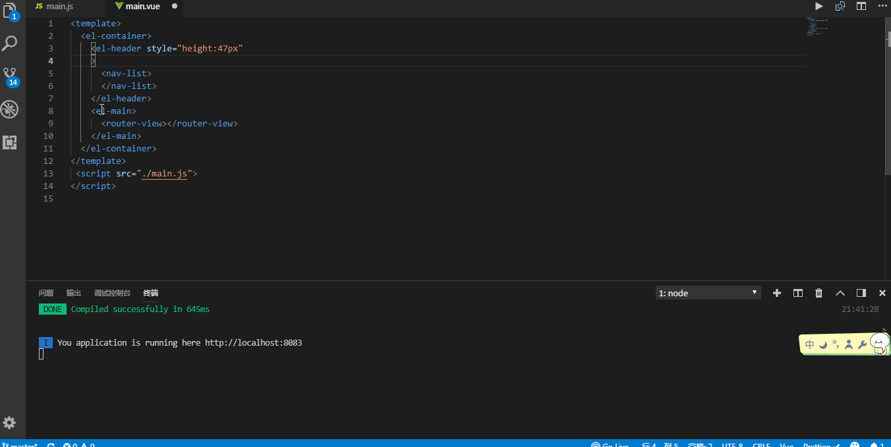

# eslint 保持一致的代码风格

#### 背景：

```bash
    前提:由于项目组件中代码风格总是各式各样，其中有编辑器，编写习惯的原有；
    导致:不利于维护；
    解决:代码统一风格自动格式化，解决js/.vue代码风格；
```

# 依靠 Eslint 解决 js 文件中的代码风格

1. npm prettier eslint-config-prettier eslint-plugin-prettier -D
   1-1.配置.eslintrc.js 文件如下:新增

```js
module.exports = {
  plugins: ["hmtl", "prettier"],
  extends: ["plugin:prettier/recommended"],
  rules: {
    camelcase: [
      "error",
      {
        properties: "never"
      }
    ]
};
```

1-2.配置.webpack.conf.js 文件如下:新增

```js
module.exports = {
    module: {
        rules: [
            {
                enforce: 'pre',
                test: /\.(js|vue)$/,
                loader: 'eslint-loader',
                exclude: /node_modules/,
                options: {
                    fix: true
                }
            }
        ]
};
```

1-3 root 下新增【.prettierrc】文件

```json
{
  "tabWidth": 4,
  "singleQuote": true,
  "semi": true,
  "trailingComma": "none",
  "printWidth": 200
}
```

# 以上仅解决 js 代码风格， vue 文件中的代码风格如下：

2. npm eslint-plugin-vue@next vue-eslint-parser -D
   2-1. 配置.eslintrc.js 文件如下:新增
   具体规则请参考规则 eslint-plugin-vue

```js
module.exports = {
  plugins: ["vue", "prettier"],
  extends: ["plugin:vue/recommended", "plugin:prettier/recommended"],
  parser: "vue-eslint-parser",
  parserOptions: {
    parser: "babel-eslint"
  },
  rules: {
    "vue/require-default-prop": 0,
    "vue/max-attributes-per-line": 0,
    "vue/no-unused-components": 0,
    "vue/order-in-components": 0,
    "vue/html-self-closing": 0
  }
};
```
## 来个效果图治愈强迫症截图
